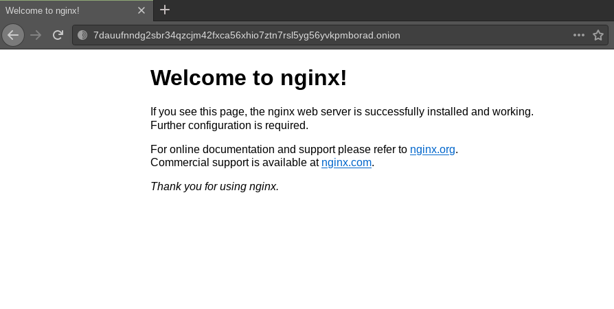

<div style="display: inline-flex; width: 100px">
  
</div>
<div style="display: inline-block; width: 100px;"></div>
<div style="display: inline-flex; width: 100px">
  
</div>

# Host a website in Tor with Nginx
How to host a laravel and nuxt dynamic website in Tor using Nginx.

## Installing Tor and Nginx

### Nginx
You can download Nginx from the [official site](https://www.nginx.com/resources/wiki/start/topics/tutorials/install/). In Debian derivades, just do:

```bash
$ sudo apt-get install nginx
```
Then, localhost:80 should show the nginx default page. Also, see the output of `nginx -v`.

### Tor
You can install the browser by the [Tor website](https://www.torproject.org/). Just download the .tar.gz file and the untar it with `tar -xvf filename`.

We will also need to add the Tor repository to our system to configure the behavior:

```bash
$ sudo su       # Enter root
$ echo -e "deb https://deb.torproject.org/torproject.org bionic main\ndeb-src https://deb.torproject.org/torproject.org bionic main" > /etc/apt/sources.list.d/tor.list             # Import the repository to apt
$ wget -qO- https://deb.torproject.org/torproject.org/A3C4F0F979CAA22CDBA8F512EE8CBC9E886DDD89.asc | gpg --import   # Import the repo key
$ gpg --export A3C4F0F979CAA22CDBA8F512EE8CBC9E886DDD89 | apt-key add       # Define the repo key

CTRL + D to exit root mode

$ apt update        # Update the repositories of the system
$ sudo apt-get install tor          # Install tor
```

If you want, configure Nginx and Tor services to start on boot with:

```bash
$ sudo systemctl enable nginx && systemctl enable tor && systemctl start tor.service
```

## Hosting a static website in tor
Before proceeding now would be the ideal time to configure firewall rules.
I'd' recommend by default let's deny incoming. Whitelist YOUR_IP to SSH. You can see your ip using `curl ifconfig.me` or `wget -qO- http://ipecho.net/plain | xargs echo`.
For demonstration purposes; we're allowing public connections to 80 and 443 - to enable a clear net version.
We need to allow connections for port 9050 for Tor delivery.

```bash
$ sudo su
$ ufw default deny incoming && ufw allow from YOUR_IP to any port 22 && ufw allow 80 && ufw allow 443 && ufw allow 9050 && ufw enable
```

Open /etc/nginx/nginx.conf - turn off our server_tokens. Change hash_bucket_size to allow for a lengthy address. I tend to use nano. If the lines are commented, remember to uncomment.

```bash
$ sudo nano /etc/nginx/nginx.conf
```
```nano
(...)

http {
    (...)
    server_tokens off;

    server_names_hash_bucket_size 125;
    (...)
}

(...)

```

Save (CTRL + S) and exit (CTRL + X).

Lets do a test in Ngix to see if all is ok:

```bash
$ sudo nginx -t

nginx: the configuration file /etc/nginx/nginx.conf syntax is ok
nginx: configuration file /etc/nginx/nginx.conf test is successful
```

Nice, then lets reload the nginx with:

```bash
$ sudo nginx -s reload
```

Proceed to configure a Hidden Service within Tor, using your editor open /etc/tor/torrc.

```bash
$ sudo nano /etc/tor/torrc
```

Add the following to the file:

```
HiddenServiceDir /var/lib/tor/nginx/
HiddenServicePort 80 127.0.0.1:80
```

Finishing, just reload tor and see your Tor URL using:
```bash
$ sudo service tor reload
$ sudo cat /var/lib/tor/nginx/hostname
# printed 7dauufnndg2sbr34qzcjm42fxca56xhio7ztn7rsl5yg56yvkpmborad.onion/
```

Now, opening the browser and pasting the URL in the search i got the Nginx page, like my localhost:80, as expected:


Ok, all working, but lets do some security changes to prevent snoopers directory listing, gaining potential information.
First, lets unlink the nginx default configuration and create a new blackhole:
```bash
$ sudo unlink /etc/nginx/sites-enabled/default
$ sudo nano /etc/nginx/sites-available/default-blackhole
```

Inside the file, paste the following:
```
server {
  listen      81 default_server;
  server_name _;
  access_log  off;
  return      444;
}
```

This will make the server listen on port 81 and return 444.
> Connection closed.
> Status code used to instruct nginx to close the connection without sending a response to the client.

Now, create the symlink:
```bash
$ sudo ln -s /etc/nginx/sites-available/default-blackhole /etc/nginx/sites-enabled/
```

Finally, lets create our site:
```bash
$ sudo nano /etc/nginx/sites-available/only.on.onion
```

Then, paste the configuration:

```
server {
  listen 81;
    root /var/www/tor/;
    allow all;
  
  # This is the location block invalid requests will be routed to
  location @blackhole {
    return 444;
  }

  # This block redirects invalid requests to @blackhole
  location / {
    # Route all errors to @blackhole
    try_files $uri $uri/ error_page 403 404 500 502 503 504 =444 @blackhole;
  }
}
```
**Remember to change the listen and root to your port and project directory**

Lets create another symlink, this one is for our site be available:

```bash
$ sudo ln -s /etc/nginx/sites-available/only.on.onion /etc/nginx/sites-enabled/
```

Again, test and reload the Nginx:
```bash
$ sudo nginx -t
$ sudo nginx -s reload
```

Lets finish it by changing the port in /etc/tor/torrc:
```bash
$ sudo nano /etc/tor/torrc
```
```
HiddenServiceDir /var/lib/tor/nginx/
HiddenServicePort 80 127.0.0.1:81
```

Now, Tor will receive our port 81 and show it on his 80

Just reload and cat the URL again:
```bash
$ sudo service tor reload
$ sudo cat /var/lib/tor/nginx/hostname
```

## References
https://hackmd.io/@5nttaW5rTgutBOCFdI5KOw/rknf8-O3I

https://drive.google.com/file/d/1ZuEfgk7oPCAujAxFO7tMwmcjjdQlYGWV/view

https://chown.io/guide-host-your-own-onion-site-tor-nginx/


# Leonardo Zanotti